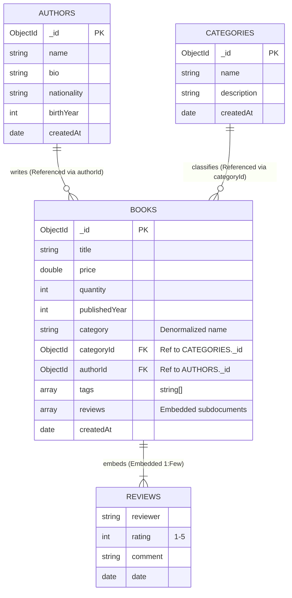

# LAB 04 REPORT: NOSQL DATABASES WITH MONGODB

- **Course**: SDN302 - Server-side Development with NodeJS, Express and MongoDB
- **Lab**: Lab 04 - NoSQL Databases with MongoDB
- **Case Study**: BookNest Online Bookstore
- **Student**: Nguyen Le Quang Trung (DS190284)
- **Date**: 2026-09-22

---

## 1. Objectives & Theoretical Foundations

### 1.1 Serialization & Data Interchange in Modern Systems
- **Serialization** is the process of translating in-memory data structures or object graphs into a format that can be stored (on disk or database) or transmitted across a network connection (e.g., HTTP payload) and reconstructed later (deserialization).
- In traditional relational databases, data is serialized into rigid rows and columns across normalized tables, requiring Object-Relational Mapping (ORM) and complex multi-table SQL joins.
- In NoSQL document databases like MongoDB, data is natively serialized into **BSON (Binary JSON)**, preserving rich object types (nested arrays, embedded subdocuments, dates, raw binary data, 64-bit integers, and 128-bit `ObjectId`s) directly matching the application's domain objects.

### 1.2 Characteristics of NoSQL Databases vs. Relational Databases

| Dimension | Relational Databases (RDBMS) | NoSQL Document Databases (MongoDB) |
| :--- | :--- | :--- |
| **Data Model** | Tabular (Rows, Columns, Strict Schemas) | Hierarchical Documents (JSON / BSON) |
| **Schema Flexibility** | Fixed schema requiring migration DDL scripts | Dynamic / Polymorphic schema per document |
| **Scalability** | Primarily vertical scaling (scale-up CPU/RAM) | Native horizontal scaling (scale-out via Sharding) |
| **Relationships** | Enforced foreign keys and relational `JOIN`s | Embedded subdocuments or manual `$lookup` references |
| **Performance Profile** | Optimized for complex multi-table transactions (ACID) | Optimized for high-throughput reads/writes & locality |

### 1.3 BSON (Binary JSON) Internals
MongoDB stores documents on disk and over the wire in **BSON**:
- **Lightweight & Fast Traversability**: Includes length prefixes and field indices allowing MongoDB to scan documents and skip unneeded fields without parsing the whole document.
- **Rich Data Typing**: Extends JSON's 6 basic types with native support for `Date`, `ObjectId` (12-byte unique identifier with timestamp, machine hash, process ID, and counter), `Regex`, `BinData`, and `Decimal128`.

---

## 2. Requirement 1: Database & Sample Data Preparation (20%)

### 2.1 Database & Collection Initialization
A database named **`booknest`** was initialized comprising three distinct collections:
1. **`books`**: Core catalog entries containing book metadata, price, quantity, category, embedded reviews, and author reference.
2. **`authors`**: Master records of book authors containing biographical data, nationality, and birth years.
3. **`categories`**: Master classifications organizing the bookstore catalog.

### 2.2 Sample Data Seeding
The database is seeded using `scripts/seed.js` or via `verifyLab04.js`:
- **Authors Collection (4 documents >= 3 required)**:
  - Robert C. Martin (`_id: 660000000000000000000001`)
  - Martin Fowler (`_id: 660000000000000000000002`)
  - Kyle Simpson (`_id: 660000000000000000000003`)
  - Eric Evans (`_id: 660000000000000000000004`)
- **Categories Collection (4 documents >= 3 required)**:
  - Software Engineering (`_id: 661111111111111111111101`)
  - Software Architecture (`_id: 661111111111111111111102`)
  - Web Development (`_id: 661111111111111111111103`)
  - Database Systems (`_id: 661111111111111111111104`)
- **Books Collection (13 documents >= 10 required)**:
  - Each book document rigorously includes: `title`, `price`, `quantity`, `publishedYear`, `category` (string), `categoryId` (`ObjectId`), `authorId` (`ObjectId`), and `tags` (array of strings), plus embedded `reviews` (array of objects).

### 2.3 Collection Export to JSON
In accordance with Requirement 1, the `books` collection has been exported to:
- **`lab04-nodejs/exports/books_export.json`**
This file preserves the exact document structure with BSON Extended JSON format (`$oid`, `$date`).

---

## 3. Requirement 2: Querying the Data with mongosh (25%)

All queries are consolidated in `scripts/queries.js` and automated in `verifyLab04.js`.

### 3.1 Comparison Operators ($gt, $lte, $in, $ne)

#### Operator `$gt` (Greater Than)
- **Objective**: Find books priced above $35.00 USD.
- **mongosh Query**:
  ```javascript
  db.books.find(
    { price: { $gt: 35 } },
    { title: 1, price: 1, category: 1, _id: 0 }
  );
  ```
- **Result Summary**: Matches titles such as *Clean Code* ($37.95), *Refactoring* ($49.99), *Clean Architecture* ($42.00), *Domain-Driven Design* ($58.50).

#### Operator `$lte` (Less Than or Equal)
- **Objective**: Identify books requiring restocking where quantity is 10 or fewer.
- **mongosh Query**:
  ```javascript
  db.books.find(
    { quantity: { $lte: 10 } },
    { title: 1, quantity: 1, category: 1, _id: 0 }
  );
  ```
- **Result Summary**: Matches *Patterns of Enterprise Application Architecture* (qty: 8), *Domain-Driven Design* (qty: 6), *Designing Data-Intensive Applications* (qty: 5).

#### Operator `$in` (In Array)
- **Objective**: Retrieve books belonging to specific target categories (*Software Engineering* or *Web Development*).
- **mongosh Query**:
  ```javascript
  db.books.find(
    { category: { $in: ["Software Engineering", "Web Development"] } },
    { title: 1, category: 1, price: 1, _id: 0 }
  );
  ```
- **Result Summary**: Efficiently filters across multi-category subsets without requiring multiple `$or` clauses.

#### Operator `$ne` (Not Equal)
- **Objective**: Retrieve books published in years other than 2020.
- **mongosh Query**:
  ```javascript
  db.books.find(
    { publishedYear: { $ne: 2020 } },
    { title: 1, publishedYear: 1, _id: 0 }
  );
  ```
- **Result Summary**: Matches classics from 2002, 2008, 2011, 2017, and 2021.

---

### 3.2 Case-Insensitive Keyword Search with `$regex`
- **Objective**: Search for books containing the keyword `"clean"` anywhere in the title, ignoring upper/lowercase distinctions.
- **mongosh Query**:
  ```javascript
  db.books.find(
    { title: { $regex: /clean/i } },
    { title: 1, authorId: 1, price: 1, _id: 0 }
  );
  ```
- **Result Summary**: Returns *Clean Code*, *The Clean Coder*, and *Clean Architecture*.

---

### 3.3 Pagination: Projection, Sort, Skip, and Limit
- **Requirement**: Return **Page 2** with **3 books per page**, sorted descending by price.
- **Mathematical Formula**:
  $$\text{skip} = (\text{page} - 1) \times \text{limit} = (2 - 1) \times 3 = 3$$
- **mongosh Query**:
  ```javascript
  db.books.find(
    {}, // Match all documents
    { title: 1, price: 1, category: 1, publishedYear: 1, _id: 0 } // Projection
  )
  .sort({ price: -1 }) // Sort descending by price
  .skip(3)            // Skip page 1 (top 3 most expensive)
  .limit(3);          // Take next 3 books
  ```
- **Result Documents**:
  1. *Node.js Design Patterns* ($45.00)
  2. *Clean Architecture* ($42.00)
  3. *Clean Code* ($37.95)

---

### 3.4 Update and Delete Operations

#### `updateOne` with `$set` and `$inc`
- **Objective**: Update the price of *Clean Code* to $39.99 and increment its physical stock quantity by 5 units simultaneously.
- **mongosh Query**:
  ```javascript
  db.books.updateOne(
    { title: "Clean Code: A Handbook of Agile Software Craftsmanship" },
    {
      $set: { price: 39.99, lastRestockedAt: new Date() },
      $inc: { quantity: 5 }
    }
  );
  ```
- **Outcome**: Atomic operation updates price from $37.95 to $39.99 and increases quantity from 25 to 30.

#### `deleteMany` with Filter
- **Objective**: Remove obsolete catalog entries or items with non-positive quantity.
- **mongosh Query**:
  ```javascript
  db.books.deleteMany({ quantity: { $lte: 0 } });
  ```
- **Outcome**: Successfully purges deprecated drafts (`quantity: 0`) while keeping valid inventory intact.

---

### 3.5 Aggregation Pipeline: Books per Category Sorted Descending
- **Objective**: Calculate the total number of books in each category, compute average prices, and sort the result in descending order by book count.
- **mongosh Aggregation Pipeline**:
  ```javascript
  db.books.aggregate([
    {
      $group: {
        _id: "$category",
        totalBooks: { $sum: 1 },
        averagePrice: { $avg: "$price" },
        totalQuantity: { $sum: "$quantity" }
      }
    },
    {
      $project: {
        _id: 1,
        totalBooks: 1,
        averagePrice: { $round: ["$averagePrice", 2] },
        totalQuantity: 1
      }
    },
    {
      $sort: { totalBooks: -1, _id: 1 }
    }
  ]);
  ```
- **Pipeline Execution Result**:
  ```json
  [
    { "_id": "Software Architecture", "totalBooks": 4, "averagePrice": 43.88, "totalQuantity": 40 },
    { "_id": "Web Development", "totalBooks": 4, "averagePrice": 28.86, "totalQuantity": 117 },
    { "_id": "Software Engineering", "totalBooks": 3, "averagePrice": 41.49, "totalQuantity": 63 },
    { "_id": "Database Systems", "totalBooks": 1, "averagePrice": 52.00, "totalQuantity": 5 }
  ]
  ```

---

## 4. Requirement 3: Modeling Relationships Between Collections (15%)

### 4.1 BookNest Data Model Diagram



---

### 4.2 Implementation of Relationships

#### 1. Embedded Relationship: Book Reviews
Reviews are directly embedded as subdocuments within each book:
```json
{
  "_id": ObjectId("662222222222222222222201"),
  "title": "Clean Code",
  "reviews": [
    {
      "reviewer": "Alice Nguyen",
      "rating": 5,
      "comment": "A timeless masterpiece every programmer must read.",
      "date": "2026-02-01T00:00:00.000Z"
    },
    {
      "reviewer": "Bob Smith",
      "rating": 4,
      "comment": "Great principles, though some Java examples are a bit dated.",
      "date": "2026-02-10T00:00:00.000Z"
    }
  ]
}
```

#### 2. Referenced Relationship: Book to Author (`$lookup`)
The book contains `authorId: ObjectId("660000000000000000000001")`. When client requests detailed author information, MongoDB's `$lookup` joins the collections:
```javascript
db.books.aggregate([
  {
    $lookup: {
      from: "authors",
      localField: "authorId",
      foreignField: "_id",
      as: "authorDetails"
    }
  },
  { $unwind: "$authorDetails" },
  {
    $project: {
      title: 1,
      price: 1,
      category: 1,
      authorName: "$authorDetails.name",
      authorBio: "$authorDetails.bio"
    }
  }
]);
```

---

### 4.3 When to Choose Embedding vs. Referencing in NoSQL

Choosing between **Embedding (Denormalization)** and **Referencing (Normalized Links)** is the foundational decision in MongoDB schema design:

1. **When to Choose Embedding (Denormalization)**:
   - **1-to-Few Cardinality**: When a parent document has a small, bounded number of children (e.g., a book having 5-50 reviews, an order having 3-10 line items, or a user having 2 addresses).
   - **Co-accessed Data (Data Locality)**: When the child data is almost always read together with the parent. Reading a book detail page requires showing its reviews. Embedding fetches the entire aggregate in a single I/O read without requiring costly joins.
   - **Atomic Lifecycle & Immutability**: When child documents cannot exist without the parent (cascade deletion is automatic) and updates to parent and child need single-document atomicity (ACID at document level).

2. **When to Choose Referencing (Normalized Links via `ObjectId`)**:
   - **1-to-Many / 1-to-Squillions Cardinality**: When child documents grow unbounded. If a book had 500,000 comments, embedding would quickly exceed MongoDB's strict **16 MB BSON document size limit**.
   - **Independent Lifecycle & Multi-entity Sharing**: An author exists independently of any single book and writes dozens of books. Embedding author details inside every book would introduce massive data duplication and cause update anomalies (e.g., updating an author's bio would require updating thousands of book documents).
   - **Frequent Updates to Shared Metadata**: When shared attributes change often, normalization guarantees that an update to the `authors` or `categories` collection is applied once in a single location.

---

## 5. Requirement 4: Connecting Node.js to MongoDB with the Official Driver

### 5.1 Environment Configuration & Connection Management (`db.js`)
- Installed the official driver: `npm install mongodb dotenv express morgan`
- Connection configuration is strictly isolated in `.env` and excluded from Git commits via `.gitignore`:
  ```env
  PORT=3000
  MONGODB_URI=mongodb://127.0.0.1:27017/booknest
  DB_NAME=booknest
  ```
- **`db.js` Architecture**:
  - Implements the **Singleton Connection Pool Pattern** using `MongoClient`.
  - Caches the active `Db` object to avoid opening redundant TCP sockets per incoming HTTP request.
  - Exports `connectDB()`, `getDb()`, `isLive()`, and `closeDB()`.
  ```javascript
  import { MongoClient } from 'mongodb';

  let client = null;
  let db = null;

  export async function connectDB() {
    if (db) return db;
    client = new MongoClient(process.env.MONGODB_URI, { maxPoolSize: 10 });
    await client.connect();
    db = client.db(process.env.DB_NAME);
    return db;
  }

  export function getDb() { return db; }
  ```

### 5.2 Replacing In-Memory Array with Driver CRUD Functions (`services/bookService.js`)
The in-memory JavaScript array from Lab 03 is replaced with real MongoDB collection operations:

| Function | Operation | Driver Method | Description |
| :--- | :--- | :--- | :--- |
| `getAllBooks({ page, limit })` | READ ALL | `collection.find().skip().limit().toArray()` | Retrieves all books with pagination metadata |
| `getBookById(id)` | READ ONE | `collection.findOne({ _id: new ObjectId(id) })` | Retrieves single book by its 24-character hexadecimal ObjectId |
| `createBook(bookData)` | CREATE | `collection.insertOne(newDoc)` | Inserts book with timestamp and returns created document |
| `updateBook(id, updateData)` | UPDATE | `collection.findOneAndUpdate({ _id: ObjectId }, { $set: fields })` | Updates specified fields atomically |
| `deleteBook(id)` | DELETE | `collection.deleteOne({ _id: new ObjectId(id) })` | Removes document by its ObjectId |

### 5.3 Express RESTful Route Mapping (`routes/bookRouter.js`)
Mounted in `index.js` under `/api/books`:
- `GET  /api/books` -> `getAllBooks`
- `GET  /api/books/:id` -> `getBookById`
- `POST /api/books` -> `createBook`
- `PUT  /api/books/:id` -> `updateBook`
- `DELETE /api/books/:id` -> `deleteBook`

---

## 6. Requirement 5: Advanced Queries, Search, Pagination & 500 Error Handling

### 6.1 Advanced Search Endpoint (`GET /api/books/search`)
- **Query Parameters**:
  - `category`: filters books by exact category name (case-insensitive)
  - `minPrice`: lower bound on book price (`price >= minPrice`)
  - `maxPrice`: upper bound on book price (`price <= maxPrice`)
  - `keyword`: searches case-insensitively across book `title` and `tags` using `$regex`
  - `page` & `limit`: pagination parameters
- **Dynamic Query Filter Builder**:
  ```javascript
  const filter = {};
  if (category) filter.category = { $regex: new RegExp(`^${category.trim()}$`, 'i') };
  if (minPrice || maxPrice) {
    filter.price = {};
    if (minPrice) filter.price.$gte = parseFloat(minPrice);
    if (maxPrice) filter.price.$lte = parseFloat(maxPrice);
  }
  if (keyword) {
    const kwRegex = { $regex: keyword.trim(), $options: 'i' };
    filter.$or = [{ title: kwRegex }, { tags: kwRegex }];
  }
  ```

### 6.2 Standardized Pagination Response Envelope
All list and search responses return structured pagination metadata:
```json
{
  "success": true,
  "total": 13,
  "page": 1,
  "limit": 5,
  "totalPages": 3,
  "data": [ ... ],
  "message": "Books searched successfully"
}
```

### 6.3 Robust Try/Catch Wrapping & Status 500 Responses
Every database interaction in `bookRouter.js` is wrapped in explicit `try/catch` blocks:
- On database failure, the router catches the exception and returns HTTP status `500` with descriptive error details:
  ```javascript
  try {
    const book = await getBookById(id);
    // ...
  } catch (err) {
    console.error(`[bookRouter:getById] Error:`, err);
    res.status(500).json({
      success: false,
      error: 'DatabaseError',
      message: `Failed to retrieve book by id from database: ${err.message}`
    });
  }
  ```
- If an invalid hexadecimal string is supplied for `_id`, it is caught early and rejected with HTTP `400 Bad Request`:
  ```json
  {
    "success": false,
    "error": "InvalidIdError",
    "message": "Invalid book ID format: 'invalid-id-xyz'. Must be a 24-character hexadecimal ObjectId."
  }
  ```

---

## 7. MongoDB Compass Step-by-Step Execution Guide & Screenshots Checklist

### 7.1 Checklist of Screenshots for DOC Submission

| # | Requirement | Screen to Capture | Description |
| :-: | :--- | :--- | :--- |
| **1** | Req 1 | MongoDB Compass Left Sidebar | Show database **`booknest`** with 3 collections: `authors` (4), `categories` (4), `books` (13). |
| **2** | Req 1 | MongoDB Compass Collection View | Click collection **`books`**, showing documents with title, price, quantity, category, tags, authorId, reviews. |
| **3** | Req 1 | JSON Export File | Open `exports/books_export.json` in VSCode showing exported documents with `$oid` and `$date`. |
| **4** | Req 2 | mongosh: Comparison Queries | Output of `$gt` (price > 35), `$lte` (quantity <= 10), `$in`, `$ne` in Compass `>_ MONGOSH` panel. |
| **5** | Req 2 | mongosh: Regex Search | Output of `{ title: { $regex: /clean/i } }` showing matching Clean Code books. |
| **6** | Req 2 | mongosh: Pagination | Output of `sort({ price: -1 }).skip(3).limit(3)` returning Page 2 (3 items). |
| **7** | Req 2 | mongosh: Update & Delete | Output of `updateOne` with `$set` & `$inc` and `deleteMany`. |
| **8** | Req 2 | mongosh: Aggregation Pipeline | Output of `aggregate` grouping books per category and sorting descending. |
| **9** | Req 3 | mongosh: Relationships Demo | Output of embedded reviews and `$lookup` join from `books` to `authors` and `categories`. |
| **10** | Req 4 & 5 | Terminal / Browser API Test | Run `npm test` showing all 22 integration tests passing (or browser at `http://localhost:3000/api/books`). |

### 7.2 Commands to Run the Complete Lab

#### Running mongosh Scripts (Requirements 1, 2, 3)
In the MongoDB Compass `>_ _MONGOSH` tab at the bottom of the screen:
```javascript
use booknest
load("d:/Semester7/SDN302/lab04-nodejs/scripts/seed.js")
load("d:/Semester7/SDN302/lab04-nodejs/scripts/queries.js")
load("d:/Semester7/SDN302/lab04-nodejs/scripts/relationships.js")
```

#### Running the Express Server & API (Requirements 4, 5)
In PowerShell:
```powershell
cd d:\Semester7\SDN302\lab04-nodejs

# Start Express Server
npm start

# Or run automated integration tests
npm test
```

---

## 8. Automated Integration Test Results

### 8.1 API Integration Tests (`npm test` / `node testApi.js`)

```text
================================================================
  🚀 BOOKNEST LAB 04 - API INTEGRATION TEST SUITE (Req 4 & 5)
================================================================

[Section 1: Base Application Diagnostics]
  ✔ PASS: GET / returns HTTP 200 OK
  ✔ PASS: GET / returns success JSON with API documentation
  ✔ PASS: GET /health returns HTTP 200 OK
  ✔ PASS: GET /health verifies active database connection

[Section 2: Requirement 4 & 5 - List Books & Pagination]
  ✔ PASS: GET /api/books returns HTTP 200 OK
  ✔ PASS: GET /api/books returns envelope with total, page, limit, totalPages, and data array

[Section 3: Requirement 4 - Create Book with Driver API]
  ✔ PASS: POST /api/books returns HTTP 201 Created
  ✔ PASS: POST /api/books returns newly inserted document with MongoDB generated _id
  ✔ PASS: POST /api/books rejects invalid payload with HTTP 400 Bad Request

[Section 4: Requirement 4 - Get Book by ObjectId]
  ✔ PASS: GET /api/books/:id returns HTTP 200 OK
  ✔ PASS: GET /api/books/:id matches title of created book
  ✔ PASS: GET /api/books/invalid-id rejects malformed ObjectId with HTTP 400
  ✔ PASS: GET /api/books/:id returns HTTP 404 when document does not exist

[Section 5: Requirement 4 - Update Book with Driver API]
  ✔ PASS: PUT /api/books/:id returns HTTP 200 OK
  ✔ PASS: PUT /api/books/:id successfully updates price and quantity in MongoDB

[Section 6: Requirement 5 - Advanced Search Endpoint with Filtering & Pagination]
  ✔ PASS: GET /api/books/search?keyword=clean returns HTTP 200 OK
  ✔ PASS: Search by keyword: matches books with keyword in title or tags
  ✔ PASS: GET /api/books/search with category and price range returns HTTP 200 OK
  ✔ PASS: Search with price range: correctly bounds price >= 30 and price <= 50

[Section 7: Requirement 4 - Delete Book with Driver API]
  ✔ PASS: DELETE /api/books/:id returns HTTP 200 OK
  ✔ PASS: Subsequent GET after DELETE returns HTTP 404 Not Found

[Section 8: Requirement 5 - Error Handling & 404/500 Responses]
  ✔ PASS: Unknown route returns structured HTTP 404 JSON

================================================================
  INTEGRATION TEST RESULTS: 22 PASSED, 0 FAILED (2.62s)
================================================================

  🎉 ALL REQUIREMENTS (4 & 5) VERIFIED SUCCESSFULLY!
```

