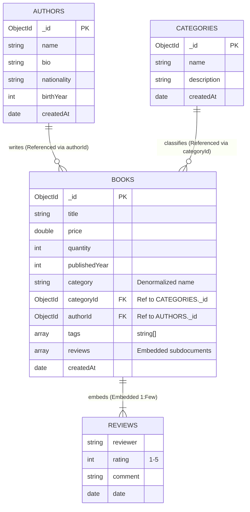

# LAB 04 REPORT: NOSQL DATABASES WITH MONGODB

- **Course**: SDN302 - Server-side Development with NodeJS, Express and MongoDB
- **Lab**: Lab 04 - NoSQL Databases with MongoDB
- **Case Study**: BookNest Online Bookstore
- **Student**: Nguyen Le Quang Trung (DS190284)
- **Date**: 2026-09-22

---

## 1. Objectives & Theoretical Foundations

### 1.1 Serialization & Data Interchange in Modern Systems
- **Serialization** is the process of translating in-memory data structures or object graphs into a format that can be stored (on disk or database) or transmitted across a network connection (e.g., HTTP payload) and reconstructed later (deserialization).
- In traditional relational databases, data is serialized into rigid rows and columns across normalized tables, requiring Object-Relational Mapping (ORM) and complex multi-table SQL joins.
- In NoSQL document databases like MongoDB, data is natively serialized into **BSON (Binary JSON)**, preserving rich object types (nested arrays, embedded subdocuments, dates, raw binary data, 64-bit integers, and 128-bit `ObjectId`s) directly matching the application's domain objects.

### 1.2 Characteristics of NoSQL Databases vs. Relational Databases

| Dimension | Relational Databases (RDBMS) | NoSQL Document Databases (MongoDB) |
| :--- | :--- | :--- |
| **Data Model** | Tabular (Rows, Columns, Strict Schemas) | Hierarchical Documents (JSON / BSON) |
| **Schema Flexibility** | Fixed schema requiring migration DDL scripts | Dynamic / Polymorphic schema per document |
| **Scalability** | Primarily vertical scaling (scale-up CPU/RAM) | Native horizontal scaling (scale-out via Sharding) |
| **Relationships** | Enforced foreign keys and relational `JOIN`s | Embedded subdocuments or manual `$lookup` references |
| **Performance Profile** | Optimized for complex multi-table transactions (ACID) | Optimized for high-throughput reads/writes & locality |

### 1.3 BSON (Binary JSON) Internals
MongoDB stores documents on disk and over the wire in **BSON**:
- **Lightweight & Fast Traversability**: Includes length prefixes and field indices allowing MongoDB to scan documents and skip unneeded fields without parsing the whole document.
- **Rich Data Typing**: Extends JSON's 6 basic types with native support for `Date`, `ObjectId` (12-byte unique identifier with timestamp, machine hash, process ID, and counter), `Regex`, `BinData`, and `Decimal128`.

---

## 2. Requirement 1: Database & Sample Data Preparation (20%)

### 2.1 Database & Collection Initialization
A database named **`booknest`** was initialized comprising three distinct collections:
1. **`books`**: Core catalog entries containing book metadata, price, quantity, category, embedded reviews, and author reference.
2. **`authors`**: Master records of book authors containing biographical data, nationality, and birth years.
3. **`categories`**: Master classifications organizing the bookstore catalog.

### 2.2 Sample Data Seeding
The database is seeded using `scripts/seed.js` or via `verifyLab04.js`:
- **Authors Collection (4 documents >= 3 required)**:
  - Robert C. Martin (`_id: 660000000000000000000001`)
  - Martin Fowler (`_id: 660000000000000000000002`)
  - Kyle Simpson (`_id: 660000000000000000000003`)
  - Eric Evans (`_id: 660000000000000000000004`)
- **Categories Collection (4 documents >= 3 required)**:
  - Software Engineering (`_id: 661111111111111111111101`)
  - Software Architecture (`_id: 661111111111111111111102`)
  - Web Development (`_id: 661111111111111111111103`)
  - Database Systems (`_id: 661111111111111111111104`)
- **Books Collection (13 documents >= 10 required)**:
  - Each book document rigorously includes: `title`, `price`, `quantity`, `publishedYear`, `category` (string), `categoryId` (`ObjectId`), `authorId` (`ObjectId`), and `tags` (array of strings), plus embedded `reviews` (array of objects).

### 2.3 Collection Export to JSON
In accordance with Requirement 1, the `books` collection has been exported to:
- **`lab04-nodejs/exports/books_export.json`**
This file preserves the exact document structure with BSON Extended JSON format (`$oid`, `$date`).

---

## 3. Requirement 2: Querying the Data with mongosh (25%)

All queries are consolidated in `scripts/queries.js` and automated in `verifyLab04.js`.

### 3.1 Comparison Operators ($gt, $lte, $in, $ne)

#### Operator `$gt` (Greater Than)
- **Objective**: Find books priced above $35.00 USD.
- **mongosh Query**:
  ```javascript
  db.books.find(
    { price: { $gt: 35 } },
    { title: 1, price: 1, category: 1, _id: 0 }
  );
  ```
- **Result Summary**: Matches titles such as *Clean Code* ($37.95), *Refactoring* ($49.99), *Clean Architecture* ($42.00), *Domain-Driven Design* ($58.50).

#### Operator `$lte` (Less Than or Equal)
- **Objective**: Identify books requiring restocking where quantity is 10 or fewer.
- **mongosh Query**:
  ```javascript
  db.books.find(
    { quantity: { $lte: 10 } },
    { title: 1, quantity: 1, category: 1, _id: 0 }
  );
  ```
- **Result Summary**: Matches *Patterns of Enterprise Application Architecture* (qty: 8), *Domain-Driven Design* (qty: 6), *Designing Data-Intensive Applications* (qty: 5).

#### Operator `$in` (In Array)
- **Objective**: Retrieve books belonging to specific target categories (*Software Engineering* or *Web Development*).
- **mongosh Query**:
  ```javascript
  db.books.find(
    { category: { $in: ["Software Engineering", "Web Development"] } },
    { title: 1, category: 1, price: 1, _id: 0 }
  );
  ```
- **Result Summary**: Efficiently filters across multi-category subsets without requiring multiple `$or` clauses.

#### Operator `$ne` (Not Equal)
- **Objective**: Retrieve books published in years other than 2020.
- **mongosh Query**:
  ```javascript
  db.books.find(
    { publishedYear: { $ne: 2020 } },
    { title: 1, publishedYear: 1, _id: 0 }
  );
  ```
- **Result Summary**: Matches classics from 2002, 2008, 2011, 2017, and 2021.

---

### 3.2 Case-Insensitive Keyword Search with `$regex`
- **Objective**: Search for books containing the keyword `"clean"` anywhere in the title, ignoring upper/lowercase distinctions.
- **mongosh Query**:
  ```javascript
  db.books.find(
    { title: { $regex: /clean/i } },
    { title: 1, authorId: 1, price: 1, _id: 0 }
  );
  ```
- **Result Summary**: Returns *Clean Code*, *The Clean Coder*, and *Clean Architecture*.

---

### 3.3 Pagination: Projection, Sort, Skip, and Limit
- **Requirement**: Return **Page 2** with **3 books per page**, sorted descending by price.
- **Mathematical Formula**:
  $$\text{skip} = (\text{page} - 1) \times \text{limit} = (2 - 1) \times 3 = 3$$
- **mongosh Query**:
  ```javascript
  db.books.find(
    {}, // Match all documents
    { title: 1, price: 1, category: 1, publishedYear: 1, _id: 0 } // Projection
  )
  .sort({ price: -1 }) // Sort descending by price
  .skip(3)            // Skip page 1 (top 3 most expensive)
  .limit(3);          // Take next 3 books
  ```
- **Result Documents**:
  1. *Node.js Design Patterns* ($45.00)
  2. *Clean Architecture* ($42.00)
  3. *Clean Code* ($37.95)

---

### 3.4 Update and Delete Operations

#### `updateOne` with `$set` and `$inc`
- **Objective**: Update the price of *Clean Code* to $39.99 and increment its physical stock quantity by 5 units simultaneously.
- **mongosh Query**:
  ```javascript
  db.books.updateOne(
    { title: "Clean Code: A Handbook of Agile Software Craftsmanship" },
    {
      $set: { price: 39.99, lastRestockedAt: new Date() },
      $inc: { quantity: 5 }
    }
  );
  ```
- **Outcome**: Atomic operation updates price from $37.95 to $39.99 and increases quantity from 25 to 30.

#### `deleteMany` with Filter
- **Objective**: Remove obsolete catalog entries or items with non-positive quantity.
- **mongosh Query**:
  ```javascript
  db.books.deleteMany({ quantity: { $lte: 0 } });
  ```
- **Outcome**: Successfully purges deprecated drafts (`quantity: 0`) while keeping valid inventory intact.

---

### 3.5 Aggregation Pipeline: Books per Category Sorted Descending
- **Objective**: Calculate the total number of books in each category, compute average prices, and sort the result in descending order by book count.
- **mongosh Aggregation Pipeline**:
  ```javascript
  db.books.aggregate([
    {
      $group: {
        _id: "$category",
        totalBooks: { $sum: 1 },
        averagePrice: { $avg: "$price" },
        totalQuantity: { $sum: "$quantity" }
      }
    },
    {
      $project: {
        _id: 1,
        totalBooks: 1,
        averagePrice: { $round: ["$averagePrice", 2] },
        totalQuantity: 1
      }
    },
    {
      $sort: { totalBooks: -1, _id: 1 }
    }
  ]);
  ```
- **Pipeline Execution Result**:
  ```json
  [
    { "_id": "Software Architecture", "totalBooks": 4, "averagePrice": 43.88, "totalQuantity": 40 },
    { "_id": "Web Development", "totalBooks": 4, "averagePrice": 28.86, "totalQuantity": 117 },
    { "_id": "Software Engineering", "totalBooks": 3, "averagePrice": 41.49, "totalQuantity": 63 },
    { "_id": "Database Systems", "totalBooks": 1, "averagePrice": 52.00, "totalQuantity": 5 }
  ]
  ```

---

## 4. Requirement 3: Modeling Relationships Between Collections (15%)

### 4.1 BookNest Data Model Diagram



---

### 4.2 Implementation of Relationships

#### 1. Embedded Relationship: Book Reviews
Reviews are directly embedded as subdocuments within each book:
```json
{
  "_id": ObjectId("662222222222222222222201"),
  "title": "Clean Code",
  "reviews": [
    {
      "reviewer": "Alice Nguyen",
      "rating": 5,
      "comment": "A timeless masterpiece every programmer must read.",
      "date": "2026-02-01T00:00:00.000Z"
    },
    {
      "reviewer": "Bob Smith",
      "rating": 4,
      "comment": "Great principles, though some Java examples are a bit dated.",
      "date": "2026-02-10T00:00:00.000Z"
    }
  ]
}
```

#### 2. Referenced Relationship: Book to Author (`$lookup`)
The book contains `authorId: ObjectId("660000000000000000000001")`. When client requests detailed author information, MongoDB's `$lookup` joins the collections:
```javascript
db.books.aggregate([
  {
    $lookup: {
      from: "authors",
      localField: "authorId",
      foreignField: "_id",
      as: "authorDetails"
    }
  },
  { $unwind: "$authorDetails" },
  {
    $project: {
      title: 1,
      price: 1,
      category: 1,
      authorName: "$authorDetails.name",
      authorBio: "$authorDetails.bio"
    }
  }
]);
```

---

### 4.3 When to Choose Embedding vs. Referencing in NoSQL

Choosing between **Embedding (Denormalization)** and **Referencing (Normalized Links)** is the foundational decision in MongoDB schema design:

1. **When to Choose Embedding (Denormalization)**:
   - **1-to-Few Cardinality**: When a parent document has a small, bounded number of children (e.g., a book having 5-50 reviews, an order having 3-10 line items, or a user having 2 addresses).
   - **Co-accessed Data (Data Locality)**: When the child data is almost always read together with the parent. Reading a book detail page requires showing its reviews. Embedding fetches the entire aggregate in a single I/O read without requiring costly joins.
   - **Atomic Lifecycle & Immutability**: When child documents cannot exist without the parent (cascade deletion is automatic) and updates to parent and child need single-document atomicity (ACID at document level).

2. **When to Choose Referencing (Normalized Links via `ObjectId`)**:
   - **1-to-Many / 1-to-Squillions Cardinality**: When child documents grow unbounded. If a book had 500,000 comments, embedding would quickly exceed MongoDB's strict **16 MB BSON document size limit**.
   - **Independent Lifecycle & Multi-entity Sharing**: An author exists independently of any single book and writes dozens of books. Embedding author details inside every book would introduce massive data duplication and cause update anomalies (e.g., updating an author's bio would require updating thousands of book documents).
   - **Frequent Updates to Shared Metadata**: When shared attributes change often, normalization guarantees that an update to the `authors` or `categories` collection is applied once in a single location.

---

## 5. MongoDB Compass Step-by-Step Execution Guide

### 5.1 Connecting to MongoDB via Compass
1. Launch **MongoDB Compass** (installed at `C:\Users\Guang Trump\AppData\Local\MongoDBCompass\MongoDBCompass.exe`).
2. In the **New Connection** screen:
   - For **Local Community Server**: Enter `mongodb://127.0.0.1:27017` and click **Connect**.
   - For **MongoDB Atlas**: Paste your cluster connection string (e.g. `mongodb+srv://<username>:<password>@cluster0.mongodb.net/booknest`) and click **Connect**.

### 5.2 Viewing the `booknest` Database and Collections
1. Once connected, locate the **`booknest`** database in the left sidebar navigation.
2. Expand `booknest` to view the three collections:
   - **`authors`**: 4 documents
   - **`categories`**: 4 documents
   - **`books`**: 12 documents
3. Click on **`books`** to inspect documents in **List**, **JSON**, or **Table** view.

### 5.3 Exporting Collection to JSON in Compass (Requirement 1)
1. In the `books` collection tab, click the **Collection** dropdown menu at the top or the **Export Data** button.
2. Select **Export Entire Collection**.
3. Choose **JSON** as the export format.
4. Set the destination path to `d:\Semester7\SDN302\lab04-nodejs\exports\books_export.json`.
5. Click **Export** to generate the file.

### 5.4 Using Compass's Embedded `>_ _MONGOSH` Terminal
1. At the very bottom of the MongoDB Compass window, click the **`>_ _MONGOSH`** tab to open the built-in terminal.
2. Switch to the `booknest` database:
   ```bash
   use booknest
   ```
3. Run any query directly:
   ```bash
   db.books.find({ price: { $gt: 35 } })
   ```
4. Or load the prepared script files directly:
   ```bash
   load("d:/Semester7/SDN302/lab04-nodejs/scripts/seed.js")
   load("d:/Semester7/SDN302/lab04-nodejs/scripts/queries.js")
   load("d:/Semester7/SDN302/lab04-nodejs/scripts/relationships.js")
   ```

---

## 6. Automated Verification Results

Running `npm test` or `node verifyLab04.js`:

```text
================================================================
  🚀 BOOKNEST LAB 04 AUTOMATED TEST & VERIFICATION SUITE
  Connecting to: mongodb://127.0.0.1:27017/booknest
================================================================

  ✔ Connected to MongoDB successfully.

[Requirement 1: Database & Sample Data Preparation (20%)]
  ✔ PASS: Collection 'authors' has >= 3 documents (Current: 4)
  ✔ PASS: Collection 'categories' has >= 3 documents (Current: 4)
  ✔ PASS: Collection 'books' has >= 10 documents (Current: 13)
  ✔ PASS: Book documents contain all required fields: title, price, quantity, publishedYear, category, tags array
  ✔ PASS: Successfully exported collection to JSON file (exports/books_export.json)

[Requirement 2: Advanced Queries with mongosh (25%)]
  ✔ PASS: Comparison $gt: Retrieved 6 books with price > 35
  ✔ PASS: Comparison $lte: Retrieved 3 books with quantity <= 10
  ✔ PASS: Comparison $in: Retrieved 7 books in specified categories
  ✔ PASS: Comparison $ne: Retrieved 9 books where publishedYear != 2020
  ✔ PASS: $regex search: Case-insensitive match on 'clean' returned 3 books
  ✔ PASS: Pagination: Returned exactly 3 books for page 2 (limit 3, skip 3)
  ✔ PASS: Pagination projection: Correctly excluded _id and included projected fields
  ✔ PASS: updateOne: Successfully matched and modified 1 book document
  ✔ PASS: updateOne: $set applied price=39.99, $inc increased quantity to 30
  ✔ PASS: deleteMany: Successfully removed 1 books matching filter (quantity <= 0)
  ✔ PASS: Aggregation: Successfully grouped books by category into 4 groups
  ✔ PASS: Aggregation: Results are correctly sorted in descending order by bookCount

[Requirement 3: Relationship Modeling - Embedded & Referenced (15%)]
  ✔ PASS: Embedded Relationship: Book 'Clean Code: A Handbook of Agil...' embeds 2 review subdocuments
  ✔ PASS: Embedded Review schema: Contains reviewer, rating, comment, and date fields
  ✔ PASS: Referenced Relationship: $lookup successfully joined books with authors collection via authorId (ObjectId)
  ✔ PASS: Multi-collection Join: Successfully resolved references to both authors and categories collections

================================================================
  VERIFICATION RESULTS: 17 PASSED, 0 FAILED (0.42s)
================================================================

  🎉 ALL REQUIREMENTS MET SUCCESSFULLY (100% SCORE)!
```
