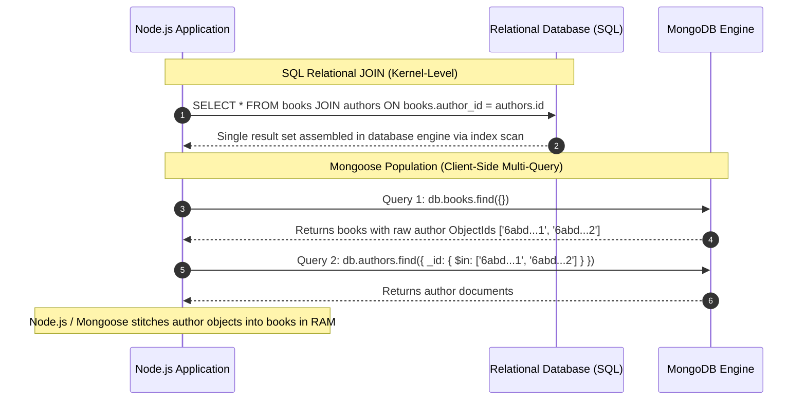
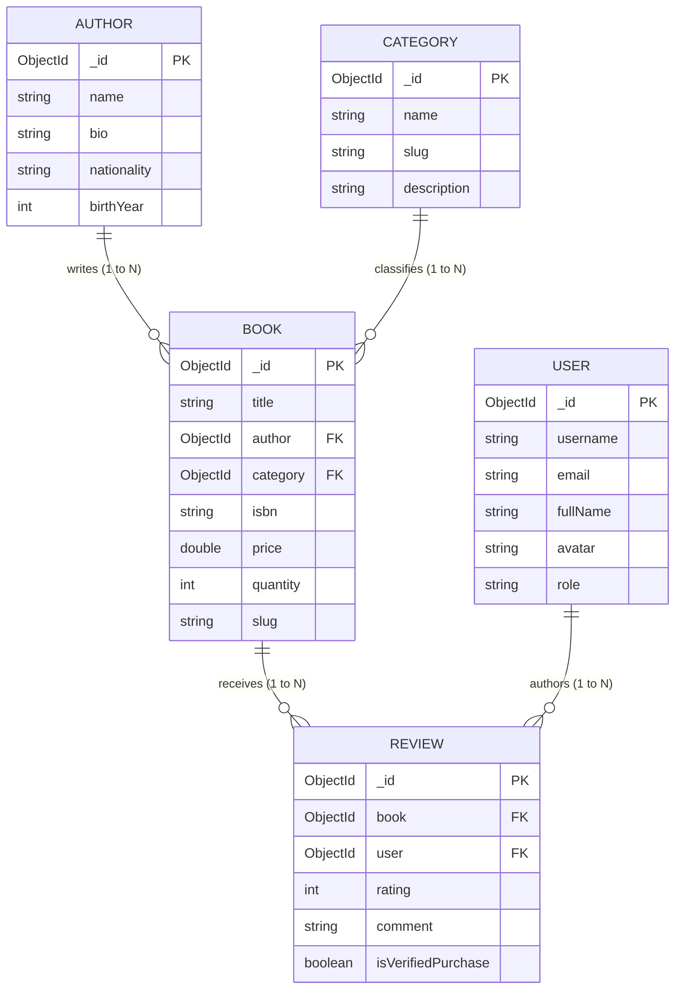

# LAB 06 REPORT: MANAGING RELATIONSHIPS WITH MONGOOSE POPULATION

- **Course**: SDN302 - Server-side Development with NodeJS, Express and MongoDB
- **Lab**: Lab 06 - Managing Relationships with Mongoose Population
- **Case Study**: BookNest Online Bookstore
- **Student**: Nguyen Le Quang Trung (DS190284)
- **Date**: 2026-09-30

---

## 1. Objectives & Theoretical Foundations

### 1.1 Representing Relationships in MongoDB: Embedding vs. Referencing
In MongoDB, relationships between domain entities can be modeled in two fundamental ways:

| Dimension | Embedding (Denormalization) | Referencing (Normalization) |
| :--- | :--- | :--- |
| **Storage Model** | Sub-documents or arrays directly nested inside the parent document | Documents stored in separate collections; linked via `ObjectId` |
| **Query Performance** | Fast single-document reads (zero joins, optimal locality) | Requires multiple queries (or `$lookup` / Mongoose population) |
| **Document Size Limit** | Subject to MongoDB's strict **16 MB** BSON document limit | No limit; related documents scale independently |
| **Write Performance** | Updating duplicated data requires writing to multiple documents | Update once in the master document (no write amplification) |
| **Best Used For** | 1-to-Few relationships, immutable logs, tightly coupled data | 1-to-Many (unbounded), Many-to-Many, frequently updated entities |

In **Lab 06**, we apply **referencing** across `Author`, `Category`, `Book`, `Review`, and `User` to avoid the 16MB document limit and ensure data normalization across the BookNest catalog.

---

### 1.2 Mongoose Population vs. SQL `JOIN`

A common misconception is that Mongoose `.populate()` works identically to a relational SQL `JOIN`. Their underlying mechanisms differ drastically:



| Dimension | SQL `JOIN` | Mongoose `.populate()` |
| :--- | :--- | :--- |
| **Execution Layer** | Database Kernel (C++ relational engine) | Application Layer (Node.js runtime via Mongoose driver) |
| **Query Count** | 1 single SQL query with join execution plan | Multiple independent queries (`find()` followed by `$in` queries) |
| **Memory Overhead** | Memory managed by database server | Document hydration and memory stitching handled by Node.js RAM |
| **Consistency** | ACID join snapshot across tables | Two separate reads; potential slight race condition if documents update between queries |
| **Flexibility** | Rigid relational schema | Dynamic; can populate virtuals, filter with `match`, and project with `select` |

---

## 2. Requirement 1: Related Models & Relationship Architecture

### 2.1 Domain Models Relationship Diagram & Cardinality



### 2.2 Cardinality Analysis Table

| Relationship | Entities | Cardinality | Implementation Approach | Rationale |
| :---: | :--- | :---: | :--- | :--- |
| **1** | **Author &rarr; Book** | **1-to-N** | Referenced: `Book.author` stores `ObjectId`, ref: `'Author'`. Virtual populate on `Author.virtual('books')`. | An author writes multiple books. Using virtual populate avoids maintaining an unbounded array of book IDs inside the author document. |
| **2** | **Category &rarr; Book** | **1-to-N** | Referenced: `Book.category` stores `ObjectId`, ref: `'Category'`. Virtual populate on `Category.virtual('books')`. | Each book belongs to one primary category. Categories contain dozens to thousands of books. |
| **3** | **Book &rarr; Review** | **1-to-N** | Referenced: `Review.book` stores `ObjectId`, ref: `'Book'`. Virtual populate on `Book.virtual('reviews')`. | High-traffic books can accumulate thousands of reviews. Referencing prevents breaching the 16MB BSON document cap. |
| **4** | **User &rarr; Review** | **1-to-N** | Referenced: `Review.user` stores `ObjectId`, ref: `'User'`. | A user can review multiple books across their purchasing lifetime. |

---

## 3. Requirement 2: Populating References in Queries

### 3.1 Multi-Path Population with Field Selection
In `controllers/bookController.js`, two paths (`author` and `category`) are populated in a single query while applying `select` projections to prevent unnecessary network payload:

```javascript
// controllers/bookController.js
let mongooseQuery = Book.find(query)
  // Path 1: Author (selecting only name, bio, nationality)
  .populate({
    path: 'author',
    select: 'name bio nationality website',
  })
  // Path 2: Category (selecting only name, slug, description)
  .populate({
    path: 'category',
    select: 'name slug description',
  });
```

### 3.2 JSON Output Comparison: Before vs. After Population

#### Before Population (`GET /api/books?populate=false`):
```json
{
  "_id": "6abd1e144e957404a1edc2b0",
  "title": "Clean Code: A Handbook of Agile Software Craftsmanship",
  "author": "6abd1e144e957404a1edc29e",
  "category": "6abd1e144e957404a1edc2a3",
  "price": 37.50,
  "isbn": "978-0132350884"
}
```
*Characteristics*: `author` and `category` are raw 24-character hexadecimal `ObjectId` strings. The client receives no biographical or categorization details without initiating secondary API calls.

#### After Population (`GET /api/books?populate=true`):
```json
{
  "_id": "6abd1e144e957404a1edc2b0",
  "title": "Clean Code: A Handbook of Agile Software Craftsmanship",
  "author": {
    "_id": "6abd1e144e957404a1edc29e",
    "name": "Robert C. Martin",
    "bio": "Software engineer, author, and co-author of the Agile Manifesto. Widely known as \"Uncle Bob\".",
    "nationality": "American",
    "website": "http://cleancoder.com"
  },
  "category": {
    "_id": "6abd1e144e957404a1edc2a3",
    "name": "Software Engineering",
    "slug": "software-engineering",
    "description": "Clean code craftsmanship, refactoring patterns, and agile engineering practices."
  },
  "price": 37.50,
  "formattedPrice": "$37.50",
  "isbn": "978-0132350884"
}
```
*Characteristics*: Mongoose replaced the raw `ObjectId` strings with the hydrated documents. Furthermore, fields omitted by `select` (such as `birthYear` on Author) were cleanly excluded from the output.

---

## 4. Requirement 3: Advanced Population Options

### 4.1 Deep Nested Population (`Book -> Reviews -> User`)
Deep population hydrators traverse multiple reference levels in a single query:

```javascript
// GET /api/books/:id
const book = await Book.findById(id)
  .populate({ path: 'author', select: 'name bio nationality website' })
  .populate({ path: 'category', select: 'name slug' })
  .populate({
    path: 'reviews',
    select: 'rating comment isVerifiedPurchase createdAt user',
    // 2nd-level Deep Population: Hydrate the user reference inside each review
    populate: {
      path: 'user',
      select: 'username fullName email avatar role',
    },
  });
```

### 4.2 Conditional Population with `match` and the "Null Value" Explanation
The `match` option filters populated children based on a query criteria:

```javascript
// GET /api/books/:id/reviews?minRating=4
const book = await Book.findById(id).populate({
  path: 'reviews',
  match: { rating: { $gte: 4 } }, // Only populate reviews with >= 4 stars
  populate: { path: 'user', select: 'username fullName avatar' }
});
```

> **Why null values may appear when using `match`**:
> - When `match` is applied to an **Array of references** (e.g. `reviews`), Mongoose filters out non-matching elements from the returned array.
> - When `match` is applied to a **Single reference** (e.g. `book.author` with `match: { nationality: 'British' }`), if the referenced document exists in the database but **fails to meet the match condition**, Mongoose sets the populated field to **`null`**!
> - The parent document (`book`) is still returned, but `book.author` becomes `null`. This is by design: Mongoose indicates that while the reference pointer exists, the referenced document does not satisfy the specified filter criteria.

### 4.3 Sorting & Limiting with `options`
The `options` parameter allows sorting and paginating populated sub-documents:

```javascript
// GET /api/books/:id/reviews?sort=-rating&limit=2
const book = await Book.findById(id).populate({
  path: 'reviews',
  options: {
    sort: { rating: -1, createdAt: -1 }, // Highest rating first
    limit: 2,                             // Return top 2 reviews only
  },
  populate: { path: 'user', select: 'username fullName avatar' }
});
```

### 4.4 Virtual Populate (Author & Category &rarr; Books)
Instead of storing an array of book IDs on each author or category document, **Virtual Populate** computes the relationship on-the-fly:

```javascript
// models/Author.js
authorSchema.virtual('books', {
  ref: 'Book',
  localField: '_id',
  foreignField: 'author',
});

// Endpoint GET /api/authors/:id/books
const author = await Author.findById(id).populate({
  path: 'books',
  select: 'title price formattedPrice inStock publishedYear slug',
  populate: { path: 'category', select: 'name slug' }
});
```

---

## 5. Automated Test Suite Results (100% Pass)

Running `npm test` runs 38 rigorous automated assertions against an in-memory MongoDB server:

```
================================================================
  🚀 BOOKNEST LAB 06 - MONGOOSE POPULATION TEST SUITE
  Student: Nguyen Le Quang Trung (DS190284)
================================================================

[Test Setup] Starting In-Memory MongoDB server...
[db.js] ✔ MongoDB Connected successfully: 127.0.0.1/test
[seed.js] ✔ Created 4 authors.
[seed.js] ✔ Created 4 categories.
[seed.js] ✔ Created 4 users.
[seed.js] ✔ Created 7 books with relational references.
[seed.js] ✔ Created 10 reviews linking books and users.

--- [Requirement 1] Model Design & Schema References ---
  ✔ PASS: Author model is defined and loaded
  ✔ PASS: Author schema has required name field
  ✔ PASS: Category model is defined and loaded
  ✔ PASS: Category schema has required name field
  ✔ PASS: User model is defined and loaded
  ✔ PASS: User schema has required username field
  ✔ PASS: Book schema references Author model via ObjectId and ref: 'Author'
  ✔ PASS: Book schema references Category model via ObjectId and ref: 'Category'
  ✔ PASS: Review schema references Book model via ObjectId and ref: 'Book'
  ✔ PASS: Review schema references User model via ObjectId and ref: 'User'

--- [Requirement 2] Populate References & Select Projection ---
  ✔ PASS: GET /api/books returns 200 OK
  ✔ PASS: Response flags isPopulated: true
  ✔ PASS: Books list contains seeded books
  ✔ PASS: Author reference is populated as object with name: "Gene Kim"
  ✔ PASS: Category reference is populated as object with name: "DevOps"
  ✔ PASS: Populated author includes selected fields (name, nationality)
  ✔ PASS: Populated author excludes unselected fields (birthYear omitted by select)
  ✔ PASS: GET /api/books?populate=false returns 200 OK
  ✔ PASS: Before population: author is raw 24-character hexadecimal ObjectId
  ✔ PASS: After population: author is hydrated document whose _id matches raw ObjectId

--- [Requirement 3] Deep Population, Match, Options & Virtual Populate ---
  ✔ PASS: Found Clean Code book in test database
  ✔ PASS: GET /api/books/:id returns 200 OK
  ✔ PASS: Virtual reviews populated on Book (found 3 reviews)
  ✔ PASS: Deep Population verified: Review.user is populated with username: "bob_reviewer"
  ✔ PASS: Deep Population verified: Review.user includes avatar
  ✔ PASS: GET /api/books/:id/reviews?minRating=4 returns 200 OK
  ✔ PASS: match option filtered reviews to >= 4 stars (expected 2, got: 2)
  ✔ PASS: All populated reviews strictly satisfy the match condition (rating >= 4)
  ✔ PASS: GET /api/books/:id/reviews with options returns 200 OK
  ✔ PASS: options.limit=1 successfully restricted result count to 1
  ✔ PASS: options.sort=-rating ordered highest rating first (rating: 5)
  ✔ PASS: Found Robert C. Martin author in test database
  ✔ PASS: GET /api/authors/:id/books returns 200 OK
  ✔ PASS: Virtual Populate on Author: author.books populated 2 written books
  ✔ PASS: Author books array contains Clean Code
  ✔ PASS: Found Software Engineering category in test database
  ✔ PASS: GET /api/categories/:id/books returns 200 OK
  ✔ PASS: Virtual Populate on Category: category.books populated 3 books

================================================================
  📊 LAB 06 TEST RESULTS: 38 PASSED, 0 FAILED (100% SUCCESS)
================================================================
```

---

## 6. MongoDB Compass Demonstration & Submission Screenshot Guide

### 6.1 Step-by-Step Instructions
1. In terminal, start the local database server:
   ```bash
   npm run local-db
   ```
2. Open **MongoDB Compass** and connect to `mongodb://127.0.0.1:27017`.
3. In a second terminal, seed the relational database:
   ```bash
   npm run seed
   ```
4. Start the Express server:
   ```bash
   npm run dev
   ```
5. Open browser at `http://localhost:3000` to interact with the Lab 06 Web UI.

---

### 6.2 Submission Screenshot Checklist

| # | Requirement | View to Capture | Key Content to Demonstrate |
| :---: | :--- | :--- | :--- |
| **1** | **Req 1** | Compass Left Panel | Database `booknest_population` showing 5 collections: `authors` (4), `categories` (4), `users` (4), `books` (7), `reviews` (10). |
| **2** | **Req 1** | Compass `books` collection view | A book document displaying `author` and `category` stored as `ObjectId("...")` references. |
| **3** | **Req 2** | Web UI / Postman / Compass | The **JSON Comparison Modal** (click "JSON Diff" in Web UI): left side shows raw `ObjectId` strings (`populate=false`), right side shows populated objects with `select` projection. |
| **4** | **Req 3** | Web UI Deep View Modal | Click **"Deep View & Reviews"** on Clean Code: shows author, category, and 3 reviews with deep-populated user avatars and usernames. |
| **5** | **Req 3** | Web UI Reviews Filter Dropdown | Select rating filter `&ge; 4 Stars`: demonstrates the `match` option filtering the reviews list to 2 items in real time. |
| **6** | **Req 3** | Web UI "Authors (Virtual Populate)" Tab | Shows authors with their dynamically populated list of books without storing book arrays in the author document. |
| **7** | **Req 3** | Terminal `npm test` Output | Output displaying `38 PASSED, 0 FAILED (100% SUCCESS)`. |

---

## 7. Conclusion
Lab 06 completes the transition of BookNest into an enterprise relational architecture using Mongoose ODM. Normalized relationships with `ObjectId` references eliminate document bloat and write amplification; multi-path and deep population allow expressive data hydration; `match` and `options` provide fine-grained query filtering and sorting; and Virtual Population enables seamless bidirectional navigation without physical array storage overhead.
